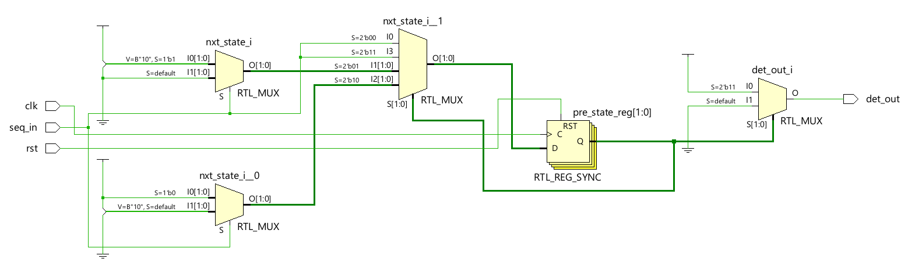
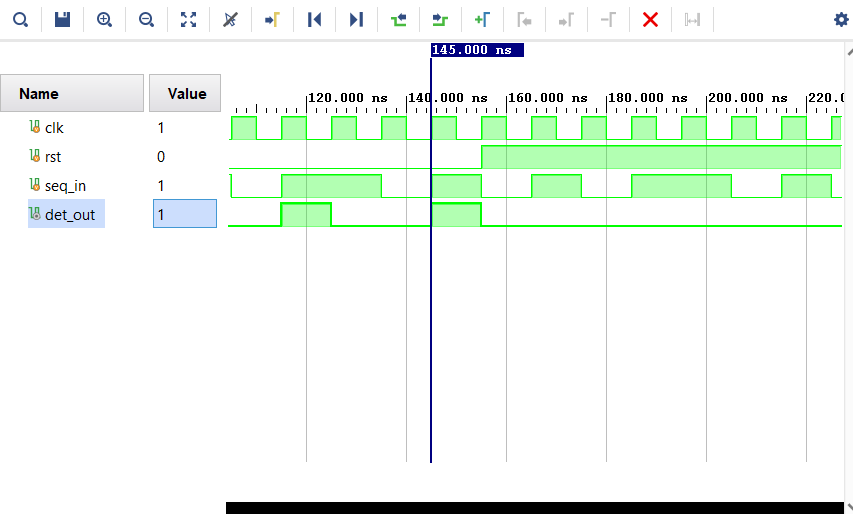

# Sequence Detector (Moore FSM)

This project implements a **Sequence Detector** using a Moore Finite State Machine (FSM) in Verilog.

## 📂 Files in this Repository
- `diagram(moore overlapping).PNG` : State diagram of the sequence detector.
- `seq_det_RTL_code` : Verilog RTL code for the sequence detector.
- `seq_det_tb` : Testbench code for simulation.
- `scematic.png` : RTL schematic generated from the design.
- `waveform.png` : Simulation waveform output.

## 📝 Description
- The FSM detects a particular sequence (customizable).
- Implemented as a **Moore machine**.
- Verified using a testbench and waveform output.

## 🚀 How to Run
1. Open the project in a simulator like **EDA Playground**, **ModelSim**, or **Xilinx Vivado**.
2. Compile the design and testbench.
3. Run simulation to generate the waveform (`.vcd` file).
4. View results using **GTKWave** or Vivado simulator.

## 📸 Outputs

## 👨‍💻 Author
- **GHALIB BIN ABDULLAH**  
- RTL Design & Verification Enthusiast
